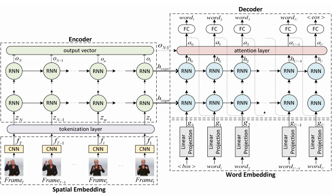

## Sign language translation SOTA paper :  Neural Sign Language Translation

pdf link: http://openaccess.thecvf.com/content_cvpr_2018/papers/Camgoz_Neural_Sign_Language_CVPR_2018_paper.pdf

model code link: https://github.com/neccam/nslt

- input이 video라는 점 : Handlang은 이미지이지만, 결국 본 논문에서도 영상을 프레임으로 잘라서 input으로 넣어주기때문에 괜찮을 것 같다.

- 사용한 dataset은 본 논문에서 직접 구축한 continuous SLT dataset

- pretrained weight를 제공하고 있음

- sign language 은 크게 두가지

  1_ CSLR

  2_ SLT

  

- Handlang의 경우 1_CSLR에 집중하는

- 이 논문에서 말하는 method: tokenization & embedding steps of standard NMT.

- model 구조

  

: CNN이 결합된 Encoder-Decoder 구조

: seq2seq

